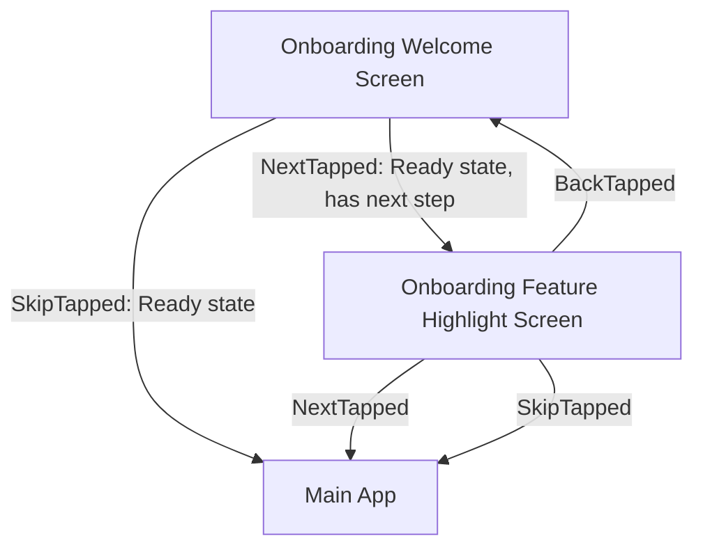

# UI Contracts: Mobile Onboarding Flow

> Part of [SPEC.md](SPEC.md). See also: [TEST-SPEC.md](TEST-SPEC.md).

> **Note on this example's Figma references:** the Figma Node URLs below are illustrative sample data for this documentation-only bundle — there's no real Figma file behind them. For a real feature, never invent values like these; get them from a connected Figma MCP tool or from the user, and use `TBD` until confirmed (see `references/files/ui-contracts.md`).

## 1. Navigation Graph

- Both `SkipTapped` exits (from either screen) leave this flow entirely — see FR-2.
- `NextTapped` from the Highlight screen is the last step in onboarding; it also exits to Main App.
- `BackTapped` from the Highlight screen returns to the Welcome screen, whose state resets to Ready.

## 2. Onboarding Welcome Screen

### State Machine Contract

| SM-ID         | State   | Event         | Do                                                  | Next State |
| :-------------- | :-------- | :-------------- | :---------------------------------------------------------- | :----------- |
| **SM-MOB-1** | Loading | ContentLoaded | —                                                          | Ready      |
| **SM-MOB-1** | Loading | LoadFailed    | —                                                          | Error      |
| **SM-MOB-3** | Error   | RetryTapped   | —                                                          | Loading    |
| **SM-MOB-2** | Ready   | SkipTapped    | Persist `OnboardingState.hasCompletedOnboarding = true`; track analytics event `onboarding_skipped`. | Exited     |
| **SM-MOB-2** | Ready   | NextTapped    | —                                                          | Exited     |

### Figma Screen State Map

| SM-ID         | State   | Figma Node URL                                                                         | Notes                                        |
| :-------------- | :-------- | :----------------------------------------------------------------------------------------- | :---------------------------------------------- |
| **SM-MOB-1** | Loading | https://www.figma.com/design/abc123XYZ/Onboarding?node-id=4-12 | Skeleton placeholder, no interactive elements. |
| **SM-MOB-2** | Ready   | https://www.figma.com/design/abc123XYZ/Onboarding?node-id=4-18   | Shows Skip and Next actions.                   |
| **SM-MOB-3** | Error   | https://www.figma.com/design/abc123XYZ/Onboarding?node-id=4-24   | Shows Retry action and error illustration.     |
| **SM-MOB-4** | Exited  | N/A                                        | Terminal — see Navigation Graph for destination. |

## 3. Onboarding Feature Highlight Screen

### State Machine Contract

| SM-ID         | State | Event       | Do                                                                                     | Next State |
| :-------------- | :------ | :------------ | :---------------------------------------------------------------------------------------------- | :----------- |
| **SM-MOB-5** | Ready | NextTapped  | Persist `OnboardingState.hasCompletedOnboarding = true`; track analytics event `onboarding_completed`. | Exited     |
| **SM-MOB-5** | Ready | SkipTapped  | Persist `OnboardingState.hasCompletedOnboarding = true`; track analytics event `onboarding_skipped`.   | Exited     |
| **SM-MOB-5** | Ready | BackTapped  | —                                                                                                | Exited     |

### Figma Screen State Map

| SM-ID         | State  | Figma Node URL                                                                              | Notes                                        |
| :-------------- | :------- | :---------------------------------------------------------------------------------------------- | :---------------------------------------------- |
| **SM-MOB-5** | Ready  | https://www.figma.com/design/abc123XYZ/Onboarding?node-id=4-30 | Shows Back, Skip, and Next actions.          |
| **SM-MOB-6** | Exited | N/A                                                   | Terminal — see Navigation Graph for destination. |
